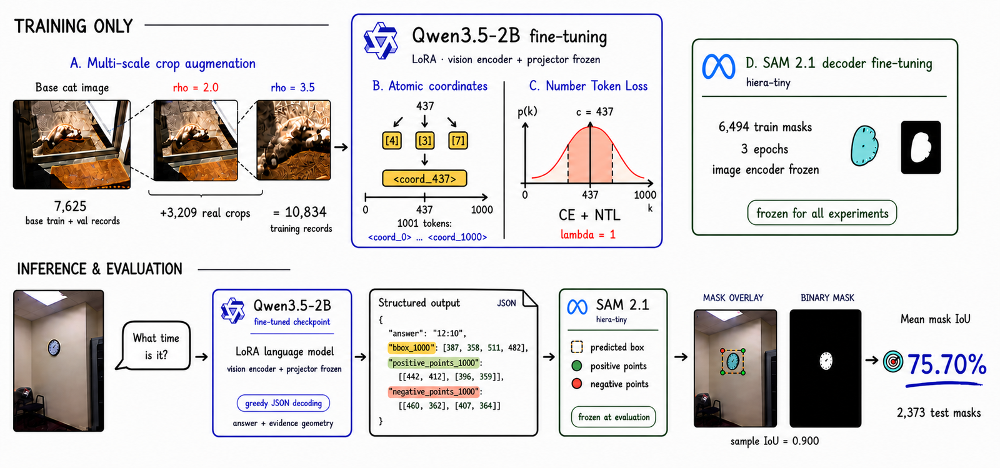
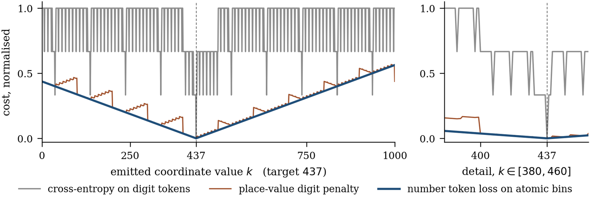
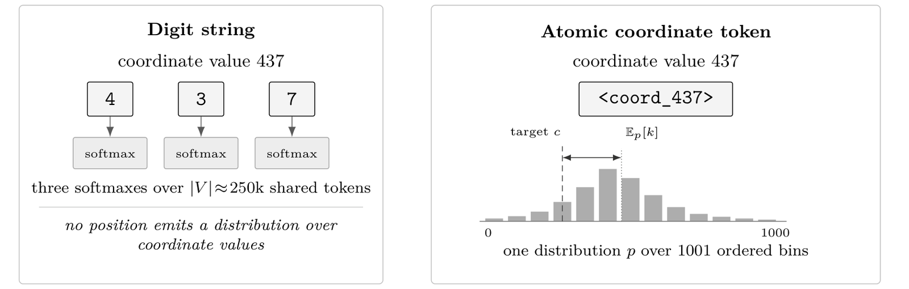
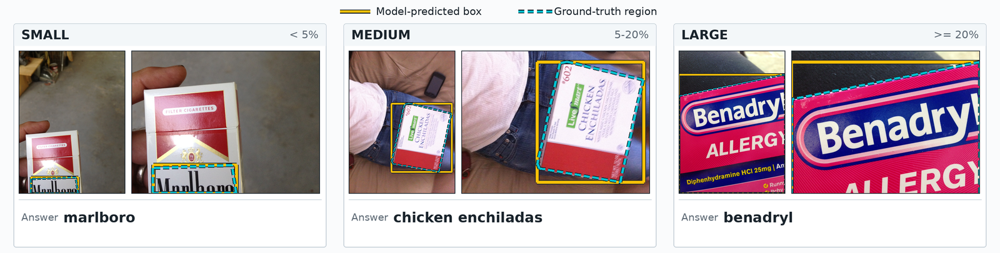
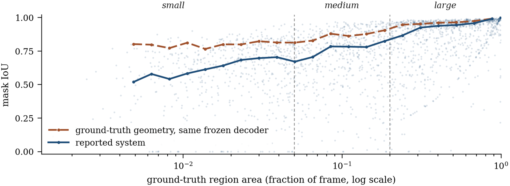
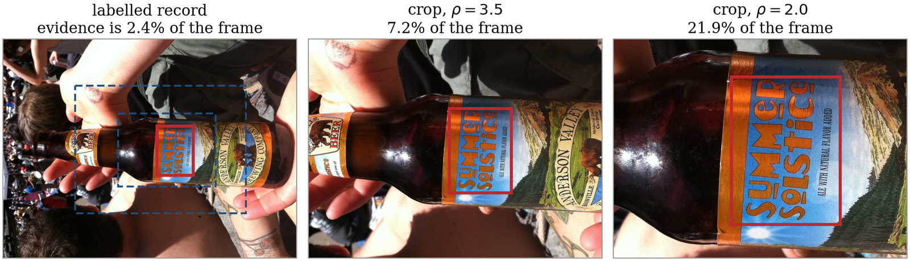

<div align="center">

# 📐 Coordinates Need a Ruler

### Atomic coordinate tokens and a number token loss for VizWiz answer grounding

[](pyproject.toml)
[](LICENSE)
[](https://drive.google.com/file/d/1O1QY73AnaHf-uv9Ei2K0f13pA5G2eNZX/view?usp=sharing)
[](#results)
[](https://huggingface.co/Qwen)
[](https://pytorch.org)

**A 2B vision–language model that answers the question *and* draws the evidence — one softmax per coordinate.**

[🎯 Results](#results) · [📦 Weights](#weights) · [⚙️ Install](#install) · [🚀 Quick start](#quickstart) · [🔬 Method](#method) · [⚠️ Caveats](#caveats)

</div>

<p align="center">
  
</p>

---

## 🧩 The problem, in one picture

Answer grounding returns the image region that justifies an answer to a visual
question. It matters most for photographs taken by blind and low-vision users,
where the evidence is often a small patch of printed text rather than a whole
object.

A model can write that region's coordinates as decimal digits. But
**cross-entropy cannot see how wrong a coordinate is** — it is a classification
loss over an unordered label set, so where the target is `437`, predicting `438`
costs exactly what predicting `900` costs. IoU is a continuous function of
coordinate error, so what is optimised and what is measured come apart.

<p align="center">
  
</p>

<table>
<tr>
<td>⬜</td><td><b>Grey</b> — cross-entropy on digit tokens. A <b>step function</b> of how many digit positions are wrong, unrelated to <code>|k − 437|</code>.</td>
</tr>
<tr>
<td>🟧</td><td><b>Orange</b> — a place-value digit penalty. Better, but sawtoothed, and it lurches at every carry (<code>399</code> → <code>400</code>).</td>
</tr>
<tr>
<td>🟦</td><td><b>Blue</b> — what this repository trains on. A clean <b>V</b> in the coordinate itself.</td>
</tr>
</table>

## ✌️ The two changes

<table>
<tr><td width="50%" valign="top">

### 🔢 &nbsp;One token per coordinate

`<coord_0> … <coord_1000>` occupy a *contiguous* block of vocabulary indices, so
a token's value is affine in its index and one softmax describes exactly one
scalar.

> The distance a loss reads **is** now the coordinate error.

</td><td width="50%" valign="top">

### 📏 &nbsp;A number token loss on it

Restrict the softmax to the coordinate columns and penalise the Wasserstein-1
distance to the target bin — read from the model's *own* output distribution.

> No auxiliary head. No decoder. No reward.

</td></tr>
</table>

<p align="center">
  
</p>

On a 2B model the pair is the largest language-model step we measure, **+5.29
bounding-box IoU**. The full system reaches **75.70% mask IoU** on the VizWiz
test split while generating the answer itself.

---

<a id="results"></a>

## 🎯 Results

| | Method | Venue | Inputs | Mask IoU |
| :-: | --- | --- | :-: | --: |
| | OSCAR attention | CVPR 2022 | I + Q | 15.48 |
| | LXMERT attention | CVPR 2022 | I + Q | 22.09 |
| | MAC-Caps | CVPR 2022 | I + Q | 27.43 |
| | LCV2 | arXiv 2024 | I + Q + A | 43.0 |
| | Unified-IO XL | ICLR 2023 | I + Q | 65.0 |
| | DDVT | CGI 2026 | I + Q | 65.3 |
| 🥉 | DaVI | VizWiz 2022 | I + Q | 70.6 |
| | SAB | ICCV 2023 | I + Q + A | 72.4 |
| 🥈 | EAB | VizWiz 2023 | I + Q + A | 74.1 |
| 🥇 | **Ours** (2B VLM → SAM 2) | — | I + Q | **75.70** |

`A` means the system consumes an answer produced by a separate stage; ours
generates its own. Our 95% interval is `[74.70, 76.68]` over 10,000 item-level
resamples. Read this as **parity with the published state of the art, not an
ordering** — see [⚠️ Reproduction notes](#caveats).

### 📈 What the two changes buy

Bounding-box IoU, by ground-truth region size. This is the localisation the
coordinate objective optimises; it runs about five points above the mask metric,
so a delta here does **not** convert into a mask-metric claim.

| | Configuration | Overall | 🔍 Small | 🔎 Medium | 🖼️ Large | Δ |
| :-: | --- | --: | --: | --: | --: | --: |
| (a) | Digit coordinates, cross-entropy | 72.91 | 52.79 | 67.48 | 85.18 | — |
| (b) | ➕ atomic coordinate tokens & NTL | 78.20 | 58.46 | 71.92 | 90.67 | **+5.29** |
| (c) | ➕ multi-scale crop augmentation | 78.77 | 59.73 | 73.11 | 90.63 | +0.57 |
| (d) | ➕ output configuration (final) | **80.90** | **62.79** | **76.40** | **91.76** | +2.13 |

Rows are successive versions, not single-variable ablations. Each is one
training run, so the intervals exclude seed variance.

### 🖼️ Predictions

<p align="center">
  
</p>

### 🔬 Where the remaining error is

<p align="center">
  
</p>

Both curves fall together towards small regions, so "small is hard" is not this
model's doing. The **gap between them** is what better geometry could recover:
prompting the same frozen decoder from the ground-truth region reaches 87.60
mask IoU. That is a reference, not an optimum — the decoder was fine-tuned on
prompts of exactly that construction, so the reference is in distribution and
the model is not. The 11.90-point difference is an *upper estimate*, and it is
concentrated at the small end.

---

<a id="weights"></a>

## 📦 Model weights

> ### 👉 [**Download the trained checkpoint**](https://drive.google.com/file/d/1O1QY73AnaHf-uv9Ei2K0f13pA5G2eNZX/view?usp=sharing) 👈
>
> 5.5 GB zip — the merged full model, row (d) of the table above.

```bash
unzip qwen3_5_2b_coord_ntl_sota.zip -d checkpoints/
# -> checkpoints/sft_run_no_think_merged/
```

A self-contained Qwen3.5-2B with the extended tokenizer and resized embedding,
loadable by 🤗 Transformers or vLLM. It is a **merged full model**, not a LoRA
adapter.

✅ Check that the gradient mask did what it claims before trusting anything else:

```bash
python scripts/verify_embedding_freeze.py \
    --merged checkpoints/sft_run_no_think_merged --base Qwen/Qwen3.5-2B
```

```text
coordinate block B = [248077, 249077], 1001 tokens, contiguous, v(i) = i - l holds
base vocab rows 248320, trained vocab rows 249088
rows of B already present in the base model: 243
input embedding : rows 0..248076 bit-identical
output head     : rows 0..248076 bit-identical
PASS
```

It fetches only the base model's embedding matrix by HTTP range request (~1 GB),
not the whole 4.55 GB checkpoint.

---

<a id="install"></a>

## ⚙️ Installation

```bash
git clone https://github.com/chuoibo/Coordinates-Need-a-Ruler.git
cd Coordinates-Need-a-Ruler
pip install -e ".[dev]"
pytest                                    # 107 tests, no GPU needed
```

The core — tokenisation, dataset building, crops, geometry, metrics — needs only
numpy, Pillow and scikit-image. Three stages need more:

| | Stage | Extra dependency |
| :-: | --- | --- |
| 🏋️ | Training | [LlamaFactory](https://github.com/hiyouga/LLaMA-Factory) 0.9.5.dev0, patched (below) |
| ⚡ | Inference | vLLM (via LlamaFactory's `ChatModel`) |
| 🎭 | Mask decoding | [SAM 2](https://github.com/facebookresearch/sam2) + a fine-tuned `hiera-tiny` checkpoint |

### 🩹 Patch LlamaFactory

Seven files carry the changes. They are vendored verbatim in
`third_party/llamafactory/files/`:

```bash
git clone https://github.com/hiyouga/LLaMA-Factory.git   # v0.9.5.dev0
pip install -e LLaMA-Factory
python scripts/apply_llamafactory_patch.py --llamafactory LLaMA-Factory
python scripts/apply_llamafactory_patch.py --llamafactory LLaMA-Factory --verify
```

`--backup` (on by default) writes `.orig` beside anything it overwrites. See
[`third_party/llamafactory/README.md`](third_party/llamafactory/README.md) for
what each file contributes.

---

<a id="quickstart"></a>

## 🚀 Quick start

Score the released checkpoint. Assumes the
[VizWiz answer-grounding data](https://vizwiz.org/tasks-and-datasets/answer-grounding-for-vqa/)
under `data/` (`data/test/`, `data/gt/`, `data/test_grounding.json`).

```bash
# 1️⃣  reporting buckets, read off the ground-truth masks (never enters the prompt)
python scripts/make_size_buckets.py \
    --gt-dir data/gt --annotations data/test_grounding.json \
    --out data/size_class_test.csv

# 2️⃣  generate
python scripts/run_inference.py \
    --model-dir checkpoints/sft_run_no_think_merged \
    --annotations data/test_grounding.json --image-dir data/test \
    --out-dir outputs/test --resume

# 3️⃣  box metric (no segmenter needed)
python scripts/evaluate.py \
    --predictions outputs/test/predictions.json --gt-dir data/gt \
    --bucket-csv data/size_class_test.csv --out-dir outputs/test

# 4️⃣  masks, then the benchmark metric
python scripts/decode_masks.py \
    --predictions outputs/test/predictions.json --image-dir data/test \
    --sam2-checkpoint checkpoints/sam2/vizwiz_hiera_tiny_finetune.pt \
    --out-dir outputs/test/masks

python scripts/evaluate.py \
    --predictions outputs/test/predictions.json --gt-dir data/gt \
    --bucket-csv data/size_class_test.csv \
    --mask-dir outputs/test/masks --annotations data/test_grounding.json \
    --out-dir outputs/test
```

Step 3 reports bounding-box IoU by region size; step 4 reports the benchmark's
mask IoU. `scripts/evaluate.py` prints the published figures alongside yours for
comparison.

---

## 🔧 Full pipeline

### 1️⃣ Build the corpus

```bash
python scripts/make_coord_tokens.py --out configs/coord_tokens_desc.yaml

python scripts/build_dataset.py \
    --grounding data/train_grounding.json --split train \
    --grounding data/val_grounding.json   --split val \
    --data-root . --out data/vizwiz_grounding/train_base.json \
    --size-out data/vizwiz_grounding/train_base_sizes.csv

python scripts/build_crops.py \
    --base data/vizwiz_grounding/train_base.json \
    --size-csv data/vizwiz_grounding/train_base_sizes.csv --data-root . \
    --image-out data/crops/images --image-prefix data/crops/images \
    --out data/vizwiz_grounding/train_ms.json \
    --manifest data/crops/manifest.json
```

Training and validation are both folded in — 6,494 + 1,131 = **7,625** records —
because every ablation row is the last checkpoint of a fixed epoch budget, so
there is nothing to hold out for. Crops add **3,209**, for **10,834**.

Each record's box and clicks are read off the annotation mask: the box is tight,
the two positive clicks 🟢 are the foreground pixels nearest and farthest from
the centroid, and the negative click 🔴 is the background pixel nearest the box
centre. Passing `--pred-mask-dir` (first-pass decoder masks) additionally mines a
*hard* negative from the decoder's own false positives inside the box; 90.0% of
the released corpus carries one.

#### 🔍 Multi-scale crops

After the processor downsamples a photograph, a small evidence region survives
as very few tokens — detail no coordinate objective can recover, because it is
no longer in the input. So we add records: the same sample re-rendered around its
region, at a zoom chosen from the region's size.

<p align="center">
  
</p>

Which records get cropped comes from the `--size-out` side table, computed from
the annotation masks. It is metadata about the corpus, not part of any record:
the prompt is byte-identical for every row, cropped or not. The plan, by region
area fraction:

| | Bucket | Area | Crops | Zoom ρ |
| :-: | --- | :-: | :-: | :-: |
| 🔍 | small | < 0.05 | 2 | 2.0, 3.5 |
| 🔎 | medium | 0.05 – 0.20 | 1 | 2.5 |
| 🖼️ | large | ≥ 0.20 | 0 | — |

A crop preserves the region's *relative* position in the frame, so directional
language in the supervised text stays true. Every crop passes a round-trip gate:
mapping its coordinates back to the full frame must land within 3 units of the
source. Crops that fail — degenerate box, positive click outside, no negative
left — are dropped. **No point is ever fabricated.**

### 2️⃣ Register and train

Copy `configs/dataset_info.snippet.json` into LlamaFactory's
`data/dataset_info.json`, then:

```bash
cd LLaMA-Factory
llamafactory-cli train  ../Coordinates-Need-a-Ruler/configs/train_stage1.yaml
llamafactory-cli train  ../Coordinates-Need-a-Ruler/configs/train_stage2.yaml
llamafactory-cli export ../Coordinates-Need-a-Ruler/configs/merge_lora.yaml
```

Five epochs in two stages: four under AdamW at `5e-4` with cosine decay, then a
final epoch at `1e-5` under a shortened warmup and with dropout enabled — the
point at which the model would otherwise begin fitting the annotation noise
rather than the geometry. LoRA rank 64 throughout, `bf16`, effective batch 32 by
gradient accumulation. The loss weight λ was tried at {0.5, 1, 2} and 1 scored
highest.

Then verify the freeze:

```bash
python scripts/verify_embedding_freeze.py \
    --merged checkpoints/qwen3_5_2b_coord_ntl --base Qwen/Qwen3.5-2B
```

### 3️⃣ Fine-tune the mask decoder

The mask stage is an **adapter to the benchmark's output format, not a
contribution** — any promptable segmenter would serve, and no result here is a
claim about the segmenter. SAM 2.1 `hiera-tiny` is fine-tuned once on the
training masks with the image encoder frozen, then frozen itself, so every later
difference in mask quality comes from the prompts. Use
[SAM 2's own trainer](https://github.com/facebookresearch/sam2); this repository
only consumes the resulting checkpoint.

---

<a id="method"></a>

## 🔬 The method in code

| Paper | Module | What it is |
| :-: | --- | --- |
| **Eq. 1** | [`cnr/coord_tokens.py`](src/cnr/coord_tokens.py) | `v(i) = i − ℓ`. The block, and the validation that it really is contiguous and ordered — a permuted block makes the numeric term optimise the wrong distance, and only an interior probe catches it. |
| **Eq. 2** | [`cnr/desc_init.py`](src/cnr/desc_init.py) | Each `<coord_k>` row seeded with the mean of the embeddings of the tokens spelling `k`. **A measured null result**, kept because it is what the released checkpoint used: 80.90 against 80.57 for `N(0, 0.02²)`, a paired difference of −0.33, interval `[−0.91, +0.27]`. |
| **Eq. 3** | [`cnr/grad_mask.py`](src/cnr/grad_mask.py) | Gradient zeroed outside the block. Hooks *every* trainable 2-D embedding/head parameter: the base checkpoint ties the two matrices but the adapter wraps them separately. |
| **Eq. 4–6** | [`cnr/ntl.py`](src/cnr/ntl.py) | Softmax restricted to the coordinate columns, Wasserstein-1 to the target bin, summed under the **same denominator** as cross-entropy. |
| **§3.6** | [`cnr/crops.py`](src/cnr/crops.py) | Multi-scale crop augmentation. |
| **§3.7** | [`cnr/prompts.py`](src/cnr/prompts.py) · [`cnr/sam2_decode.py`](src/cnr/sam2_decode.py) | Prompt targets from a mask; geometry → mask. |

> 💡 The single denominator in Eq. (6) is not cosmetic. Normalising only the
> numeric term per micro-batch would multiply its effective weight by roughly
> `gradient_accumulation_steps` — 32 here — so `λ = 1` would silently mean
> `λ = 32`. `tests/test_ntl.py::test_both_terms_share_the_denominator` pins it.

### 🕳️ Things that fail quietly if you get them wrong

| | |
| :-: | --- |
| 🔇 | **`skip_special_tokens=False` at decode.** The coordinate tokens are registered as special, so the default decoder strips them and every response comes back with empty geometry. This is the most common way to "reproduce" a score of zero. `scripts/run_inference.py` sets it. |
| ✂️ | **`cutoff_len` must scale with `image_max_pixels`.** Raising the pixel budget alone truncates the image tokens and crashes inside the model's rotary-position code, several layers from the actual mistake. 6553600 pixels needs 6144. |
| 📄 | **The prompt is one file.** `configs/instruction.txt`, checked by sha256 on load. Training and inference read the same bytes. |
| 🧬 | **Merging needs the vocabulary config.** `merge_lora.yaml` keeps `new_special_tokens_config` / `resize_vocab` so the base embedding is resized before the merge; without it the trained coordinate rows have nowhere to land. |

---

<a id="caveats"></a>

## ⚠️ Reproduction notes

Everything below is a reason to read the headline number carefully. None of it
is repaired in this repository, because repairing it silently would make the
published number unreproducible.

🔄 **The mask stage does not apply EXIF orientation; the language-model stage
does.** On the 205 of 2,373 test items whose stored and upright dimensions
differ, SAM 2 is prompted in the rotated frame — 66.34 mask IoU there against
76.59 elsewhere. The reported numbers are therefore an **underestimate**.
`scripts/decode_masks.py --exif-transpose` fixes the frame, and the result is
then no longer comparable to 75.70.

🏠 **Scoring is local.** The defect above also transposes those PNGs, which the
official scorer rejects; the evaluation server is closed, so we score against
the released test masks, which may differ from those behind the leaderboard.

🎣 **The test split was selected on.** More than a dozen configurations were
scored on the same 2,373 items and we report the best 2B one, so the margin in
the comparison table has no independent selection set behind it.

0️⃣ **One item produces no usable geometry and is scored zero, not dropped.**
Dropping it instead reports 75.73. `evaluate_mask_directories(...,
missing_scores_zero=True)` is the default, and
`tests/test_geometry_metrics.py::test_missing_prediction_scores_zero_rather_than_vanishing`
pins the rule.

🪜 **The progression is not a controlled sweep.** Consecutive rows differ in more
than the component named at that step. In particular (a)→(b) also carries a
corpus rewrite — the same 7,625 records with identical geometry but regenerated
surrounding text for 3,257 of them — which is a live competing explanation for
part of the +5.29 that we cannot separate.

👯 **112 of 2,373 test items have a training near-duplicate** at perceptual-hash
Hamming distance ≤ 4. They score *lower* than the rest (72.39 against 75.87 mask
IoU), so the overlap does not inflate the number.

---

## 🧪 Tests

```bash
pytest                      # 107 tests
pytest tests/test_ntl.py    # the loss alone
```

No GPU, no model, no dataset required. `tests/test_pipeline_end_to_end.py`
fabricates eight images and drives the command-line pipeline end to end, so a
broken argument or a mismatched output path fails there rather than four hours
into a real run.

## 📁 Repository layout

```text
📂 configs/       instruction.txt (sha256-checked), coord token table, train/merge YAMLs
📂 docs/assets/   figures used by this README
📂 src/cnr/       the library — one module per component, framework-free where possible
📂 scripts/       command-line entry points, one per pipeline stage
📂 third_party/   the seven LlamaFactory files carrying our changes, + apply script
📂 tests/         unit tests and an end-to-end pipeline test
```

---

## 📖 Citation

```bibtex
@misc{la2026coordinates,
  title  = {Coordinates Need a Ruler: Atomic Coordinate Tokens and a Number
            Token Loss for VizWiz Answer Grounding},
  author = {Ki{\d{\^e}}t L{\~a}},
  year   = {2026},
  note   = {https://github.com/chuoibo/Coordinates-Need-a-Ruler}
}
```

## 🙏 Acknowledgements

- 🏭 **[LlamaFactory](https://github.com/hiyouga/LLaMA-Factory)** (Zheng et al.,
  ACL 2024 demo; Apache-2.0) — the training framework. The multimodal data
  pipeline, the Qwen templates and the LoRA plumbing are theirs; our changes are
  the seven files in `third_party/llamafactory/`, which keep their licence
  headers. This project would have been a much larger undertaking without it.
- 🎭 **[SAM 2](https://github.com/facebookresearch/sam2)** (Ravi et al., Meta AI;
  Apache-2.0) — the promptable segmenter behind the mask stage.
- 👁️ **[VizWiz](https://vizwiz.org/tasks-and-datasets/answer-grounding-for-vqa/)**
  (Chen et al., CVPR 2022) — the benchmark, and the blind and low-vision
  photographers whose questions make up the dataset.
- 🤖 **[Qwen3.5-VL](https://huggingface.co/Qwen)** — the base model.
- 📐 The number token loss follows Zausinger et al.; the ordered-support idea has
  precedent in Distribution Focal Loss and was reached independently in
  time-series forecasting and robot navigation. We claim its transposition to
  image coordinates in a pretrained VLM, not the mechanism.

## 📜 License

MIT — see [LICENSE](LICENSE). Vendored LlamaFactory files remain Apache-2.0
under their original headers. The VizWiz dataset and the Qwen and SAM 2
checkpoints carry their own terms.

<div align="center">
<br>
<sub>Built for photographs nobody could frame.</sub>
</div>
